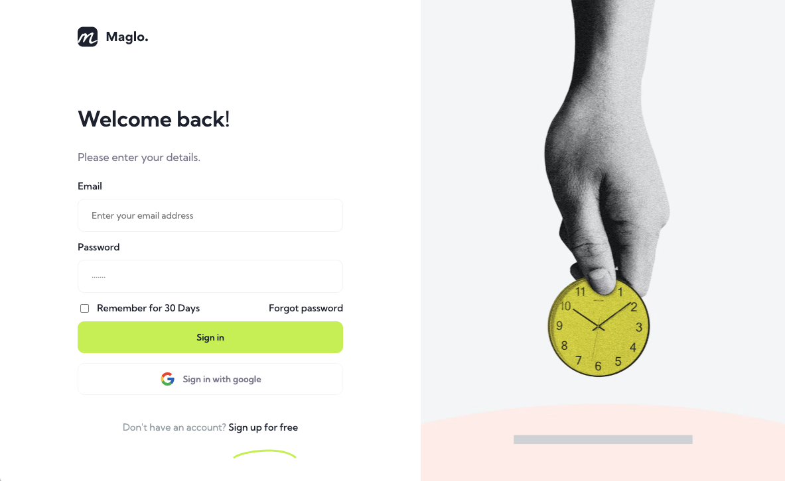
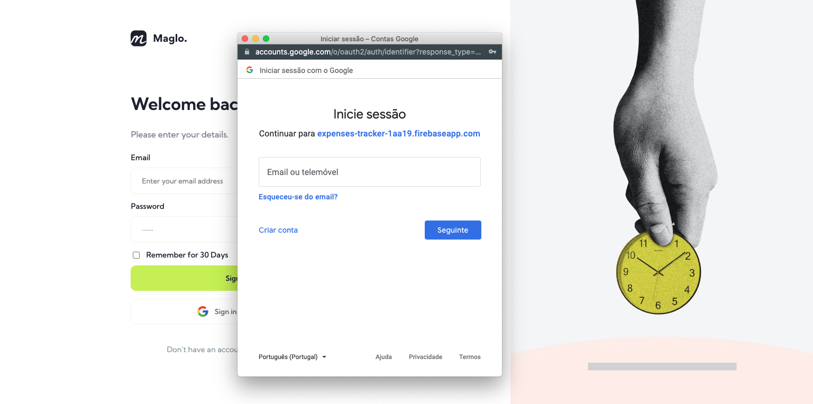
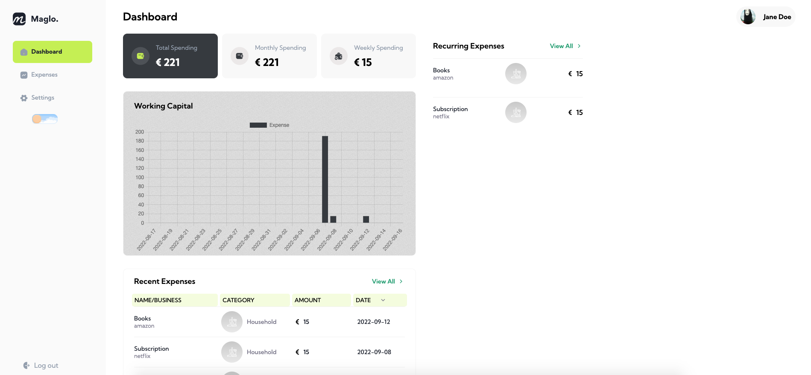
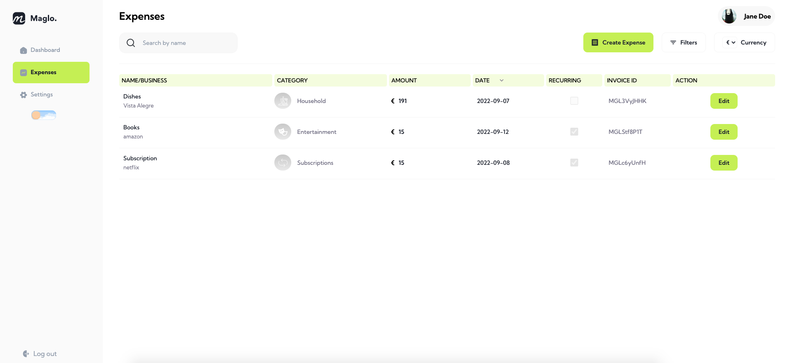
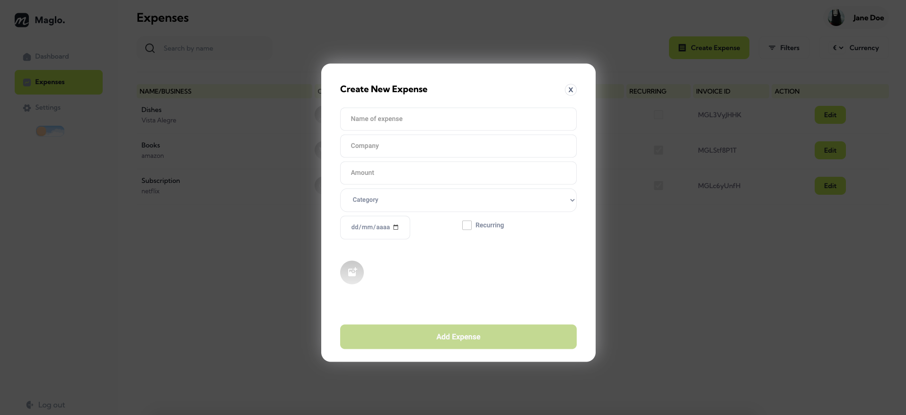
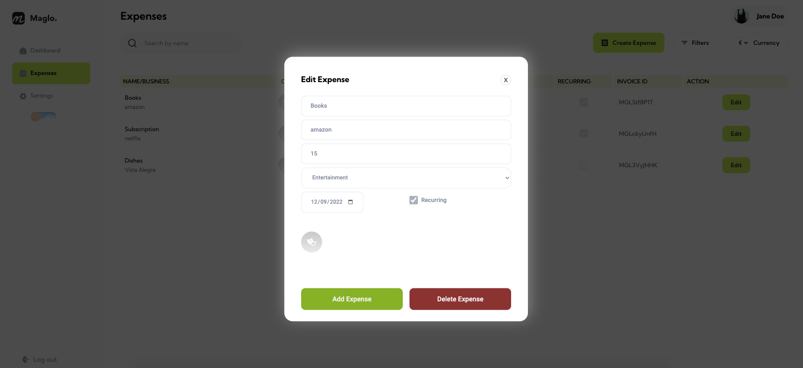
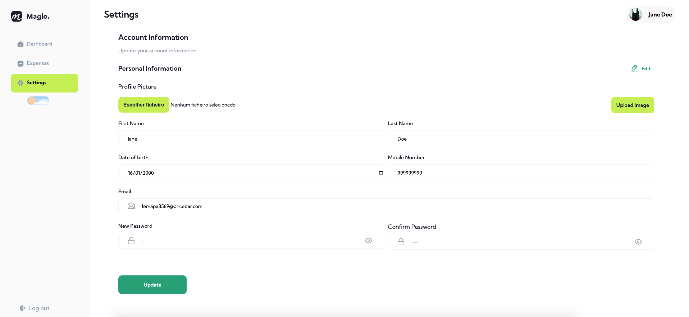
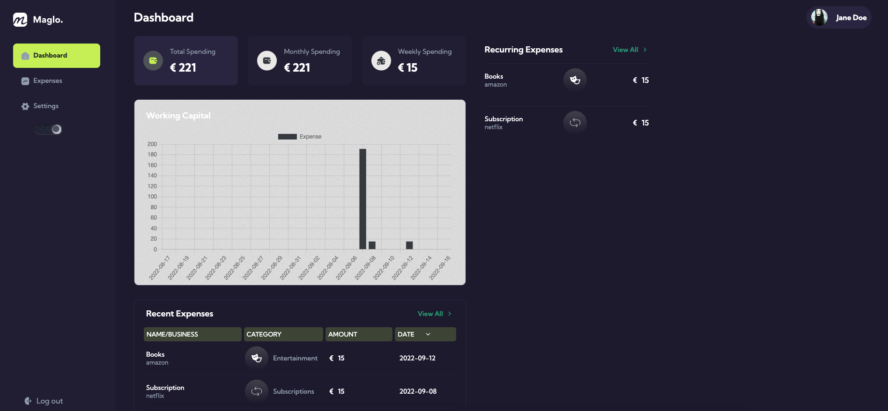
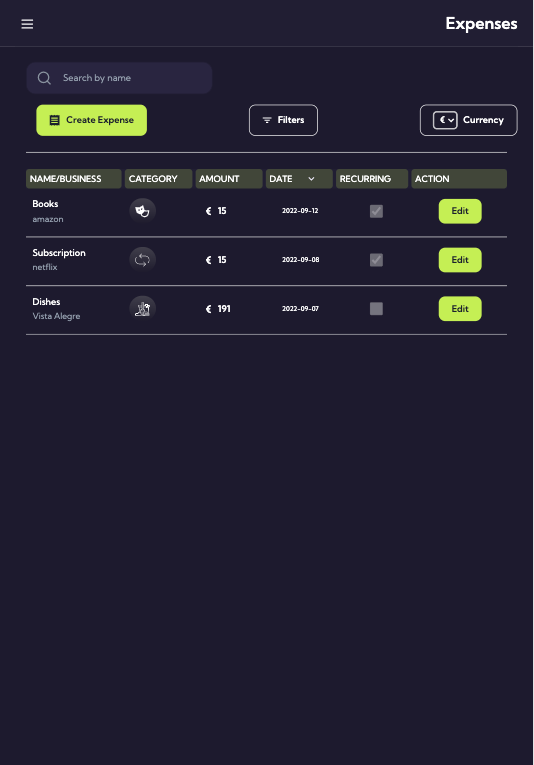
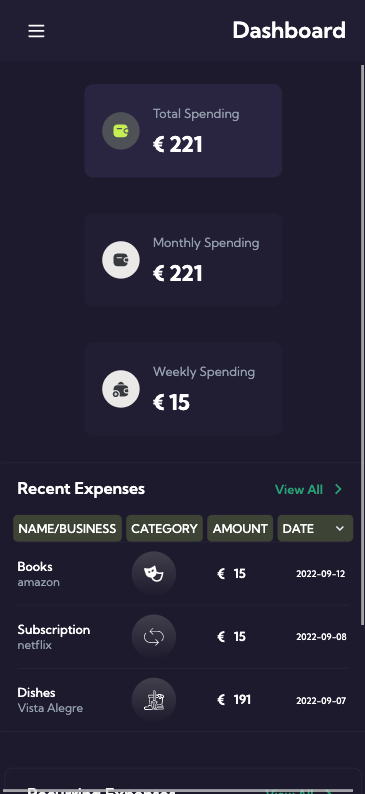

# Expenses Tracker App

This project is a expense tracker application fully built with React. The account and database information was built with Firebase from Google and was also developed the option of sign in with Google beside of classic e-mail/password authentication.

The Website is divided into three pages:

-The Dashboard (Homepage)[Dashboard](#dashboard-page)

-The Expenses Page [Expenses](#expenses-page)

-The Settings Page [Settings](#settings-page)

It was developed a dark theme to the full website [DarkMode](#dark-mode) and it's fully responsive [responsiveness](#responsiveness)

## Sign in and Sign up

The sign in and sign up page are mostly similar in terms of design. In the next image is presented the sign in page with functionalities such as remembering the user for 30 days or requesting a new password (it will send an e-mail to procceed to new changes)

  

The Google sign page will automatically pop-up a new page to follow the login instructions:

  

## Dashboard Page

The Dashboard component allows the user to see the resume of expenses. Besides of showing the amounts spent (total, monthly and weekly) it also shows a graph with the expenses of the last month and a table with the most recent expenses and the other with recurring expenses (such as subscriptions).

  

## Expenses Page

In this component is possible to see all of the expense information as also create new ones.
There is the option to change the currency of all the expenses, as well as choose how to filter the expenses based on the date of the expense or other options as preferred.
It is always possible to edit any expense information.
It is also possible to search the expense through the name on the SearchBar

  

To create a new expense it will open a new window where the user can fill the information

  

To edit the details of a expense, it will open a new window (similar to the previous with the information filled in).

  

## Settings Page

The settings page contains the user information and allows the change of any information that is needed.

  

### Dark Mode

At the navbar we can change the theme mode of the website from light to dark.

  

### Responsiveness

The website can be responsive to fit Tablets and also phones.

The view on a tablet:

  

The view on a mobile device (the example as the dimensions of the Iphone XR)

  

